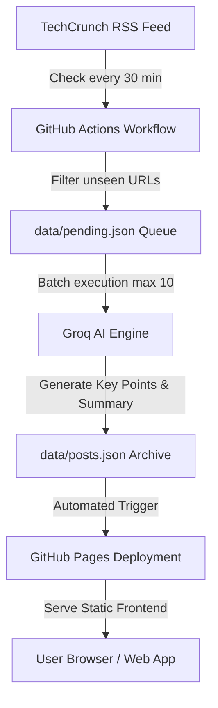

<div align="center">

# TECHNEWS_404
### *Automated, AI-Powered Tech News Digest — Without the Noise*

[](https://github.com/rutaabali3/TECHNEWS_404/actions/workflows/update-posts.yml)
[](https://github.com/rutaabali3/TECHNEWS_404/actions/workflows/pages/pages-build-deployment)
[](https://groq.com/)
[](LICENSE)

<br/>

[**Explore Live Site**](https://rutaabali3.github.io/TECHNEWS_404/) • [**View Architecture**](#architecture--data-flow) • [**Quick Setup**](#quick-setup) • [**Contributing**](#contributing)

<hr/>

</div>

## Key Highlights

> [!TIP]
> **Zero Server Maintenance**: Fully powered by GitHub Actions cron triggers and GitHub Pages static hosting. No backend servers, databases, or cloud infrastructure needed!

| Feature | Description |
| :--- | :--- |
| **AI-Powered Summaries** | Leverages **Groq API** (`openai/gpt-oss-20b`) to extract concise summaries, key points, and topics from TechCrunch articles. |
| **Real-Time Automated Sync** | GitHub Actions checks TechCrunch RSS every 30 minutes, queues new stories, and updates post archives continuously. |
| **Lightning Fast Frontend** | Pure, dependency-free vanilla JS, CSS3, and semantic HTML5 for sub-second load times and zero framework overhead. |
| **Interactive Likes & Saves** | Community likes and local bookmarking capabilities built right into the frontend digest cards. |
| **SEO & Social Optimization** | Fully standard-compliant JSON-LD structured data, OpenGraph, Twitter Cards, dynamic sitemaps, and RSS metadata. |

---

## Architecture & Data Flow



---

## Feature Overview Grid

<details open>
<summary><b>Expand/Collapse Detailed Capabilities</b></summary>

<br/>

- **Feed Monitoring**: Continuously fetches new technology articles from `https://techcrunch.com/feed/`.
- **Smart Queueing**: Implements rate-limit safe queue processing in `data/pending.json` with multi-key Groq support.
- **Automated Archiving**: Preserves the latest 100 enriched article summaries in `data/posts.json`.
- **Modern Cyberpunk/Clean UI**: Dark theme aesthetic with smooth interactive cards, category badges, and quick links.
- **Concurrency Locked**: Workflow execution prevents overlapping runs using strict GitHub concurrency locks.

</details>

---

## Quick Setup

Getting your own instance of **TECHNEWS_404** up and running in minutes:

<details>
<summary><b>Step 1: Fork & Clone</b></summary>

```bash
git clone https://github.com/rutaabali3/TECHNEWS_404.git
cd TECHNEWS_404
```
</details>

<details>
<summary><b>Step 2: Configure Secrets</b></summary>

1. Get a free API key from [Groq Cloud Console](https://console.groq.com/).
2. Navigate to your repository: **Settings → Secrets and variables → Actions → New repository secret**.
3. Name: `GROQ_API_KEY_1` (or legacy `GROQ_API_KEY`).
4. Value: *Your Groq API Key*.

> [!NOTE]
> You can add multiple key secrets (`GROQ_API_KEY_1`, `GROQ_API_KEY_2`, etc.) to automatically load balance requests across accounts if hitting rate limits.
</details>

<details>
<summary><b>Step 3: Enable GitHub Pages</b></summary>

1. Go to **Settings → Pages**.
2. Source: Select **GitHub Actions**.
3. Trigger your first run manually in **Actions tab → Update TechCrunch summaries → Run workflow**.
</details>

---

## Tech Stack & Dependencies

- **Automation & Scheduling**: GitHub Actions (`cron: */30 * * * *`)
- **AI Processing**: Python 3.12, BeautifulSoup4, Requests, Groq API (`openai/gpt-oss-20b`)
- **Frontend Engine**: HTML5, CSS3 (Modern Flexbox/Grid + Variables), Vanilla ES6 JavaScript
- **Testing Suite**: Node.js Native Test Runner (`node --test`), Python `unittest`

---

## Local Development & Testing

Run unit tests locally to verify utility functions and scripts:

```bash
# Run JavaScript Frontend Unit Tests
npm test

# Run Python Backend Updater Tests
python3 -m unittest discover tests
```

---

## Live Site & Social Preview

- **Live URL**: [https://rutaabali3.github.io/TECHNEWS_404/](https://rutaabali3.github.io/TECHNEWS_404/)
- **RSS Source**: [TechCrunch Feed](https://techcrunch.com/feed/)

> [!IMPORTANT]
> All article summaries and key takeaways are generated automatically using AI. Original article attribution and full links belong solely to **TechCrunch**.

<div align="center">

Made with AI • Automated with GitHub Actions

</div>
