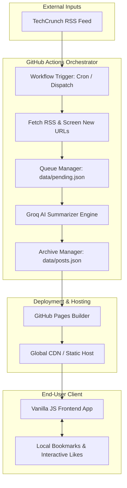

<div align="center">

# TECHNEWS_404

### Automated, AI-Powered Tech News Digest — Zero Overhead, High Signal

[](https://github.com/rutaabali3/TECHNEWS_404/actions/workflows/update-posts.yml)
[](https://github.com/rutaabali3/TECHNEWS_404/actions/workflows/pages/pages-build-deployment)
[](https://groq.com/)
[](LICENSE)

<br/>

[**Explore Live Site**](https://rutaabali3.github.io/TECHNEWS_404/) • [**System Architecture**](#system-architecture--data-flow) • [**Quick Start Guide**](#quick-start-guide) • [**Contributing**](CONTRIBUTING.md) • [**License**](LICENSE)

---

</div>

## Overview

**TECHNEWS_404** is an autonomous, serverless technology news aggregator and summarizer. It continuously monitors technology feeds, leverages large language models via the Groq API to distill articles into concise key takeaways, and publishes static web digests deployed via GitHub Pages.

Designed with a zero-maintenance philosophy, the system operates entirely within GitHub Actions workflows and static client-side rendering—eliminating the need for dedicated servers, databases, or cloud infrastructure.

---

## Interactive Feature Breakdown

Click on any section below to expand detailed capabilities:

<details open>
<summary><b>Automated Ingestion and AI Summarization Engine</b></summary>

<br/>

- **RSS Monitoring**: Automated cron workflow runs every 30 minutes to fetch the latest feed items from TechCrunch.
- **Deduplication Queue**: Pending URLs are screened against existing archives and tracked in `data/pending.json` to prevent re-processing.
- **LLM Synthesis**: Uses Groq API with `openai/gpt-oss-20b` to generate key bullet points, concise summaries, estimated reading times, and category tags.
- **API Key Load Balancing**: Supports multiple configured API keys (`GROQ_API_KEY_1`, `GROQ_API_KEY_2`, etc.) with automatic rotation and rate-limit handling.
- **Batch Processing**: Concurrently processes items in configurable batch sizes (default 10) using Python `ThreadPoolExecutor`.

</details>

<details>
<summary><b>Lightweight Frontend & UI Architecture</b></summary>

<br/>

- **Zero-Dependency Core**: Built with pure semantic HTML5, modern CSS3 (Flexbox/Grid, CSS custom properties), and vanilla ES6+ JavaScript.
- **Interactive Storage**: Community likes updated via GitHub repository dispatch events and local client bookmarking via `localStorage`.
- **Dynamic Search & Filtering**: Instant client-side text search across article titles, summaries, key takeaways, and categories.
- **Responsive Theme Design**: Cyberpunk-inspired dark UI optimized for desktop, tablet, and mobile displays.

</details>

<details>
<summary><b>SEO, Metadata & Syndication</b></summary>

<br/>

- **Structured Data**: Standard JSON-LD rich snippets for search engine indexing.
- **Open Graph & Twitter Cards**: Dynamic social sharing preview tags (`og-image.svg`).
- **Syndication**: Automatically updated `sitemap.xml`, `robots.txt`, and Web App Manifest (`site.webmanifest`).

</details>

---

## System Architecture & Data Flow



---

## Environment Variables & Configuration Options

The Python updater script (`scripts/update_posts.py`) and workflow behavior can be configured using environment variables:

| Variable | Default Value | Description |
| :--- | :--- | :--- |
| `GROQ_API_KEY` | *(Required)* | Primary API key for accessing the Groq AI service. |
| `GROQ_API_KEY_1`, `2`, ... | *(Optional)* | Multiple API keys for automatic load balancing and fallback. |
| `GROQ_MODEL` | `openai/gpt-oss-20b` | LLM model name used for summarization tasks. |
| `MAX_BATCH_PER_RUN` | `10` | Maximum number of pending articles to process in a single workflow run. |

---

## Quick Start Guide

### Prerequisites

- Git
- Python 3.10+
- Node.js 18+
- Groq Cloud API Key ([Get a key](https://console.groq.com/))

### Step 1: Clone the Repository

```bash
git clone https://github.com/rutaabali3/TECHNEWS_404.git
cd TECHNEWS_404
```

### Step 2: Configure Environment & Run Locally

```bash
# Set up Python environment
python3 -m venv venv
source venv/bin/activate
pip install pytest requests beautifulsoup4

# Export your Groq API key
export GROQ_API_KEY="your_groq_api_key_here"

# Execute the news update process locally
python3 scripts/update_posts.py
```

### Step 3: Run the Frontend Local Server

Because the frontend is zero-dependency vanilla web tech, you can serve it with any standard HTTP server:

```bash
# Using Python builtin HTTP server
python3 -m http.server 8000
```

Open `http://localhost:8000` in your web browser.

---

## Verification & Testing

Ensure code quality and integrity by executing the local unit test suites:

<details open>
<summary><b>Running Unit Test Suites</b></summary>

<br/>

```bash
# Execute JavaScript Frontend Unit Tests (Node.js native test runner)
npm test

# Execute Python Backend Unit Tests (Pytest)
PYTHONPATH=. python3 -m pytest
```

</details>

---

## File Structure Overview

```
TECHNEWS_404/
│
├── .github/workflows/     # GitHub Actions workflow definitions
├── data/
│   ├── likes.json         # Article like tallies
│   ├── pending.json       # Queued article URLs awaiting AI processing
│   └── posts.json         # Processed article summaries archive
├── scripts/
│   ├── update_posts.py    # Main feed fetcher and AI summarizer
│   └── update-likes.js    # Like count update handler
├── tests/                 # Python unit test suite
├── test/                  # JavaScript frontend unit test suite
├── app.js                 # Frontend application logic and interaction handler
├── index.html             # Application entry point
├── styles.css             # Application styling and dark theme rules
├── CONTRIBUTING.md        # Open-source contribution guidelines
├── LICENSE                # MIT License
└── README.md              # Project documentation
```

---

## Contributing

Contributions are welcome. Please read our [Contributing Guidelines](CONTRIBUTING.md) for details on our code of conduct, development process, and pull request procedures.

---

## License

This project is licensed under the MIT License. See the [LICENSE](LICENSE) file for details.

---

<div align="center">

Automated with GitHub Actions • Powered by Groq AI • Hosted on GitHub Pages

</div>
